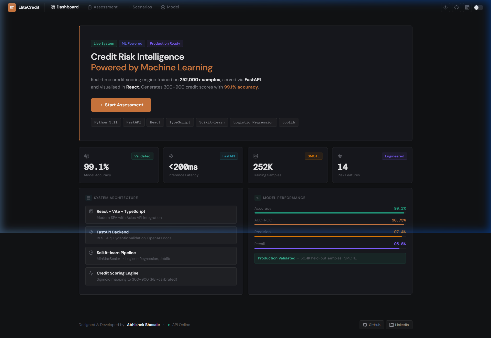
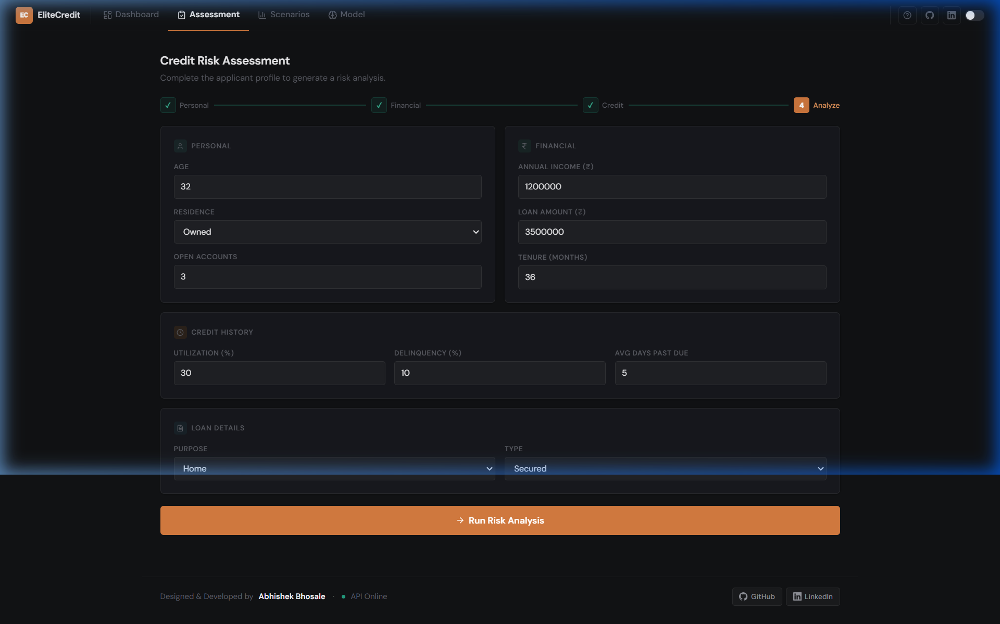
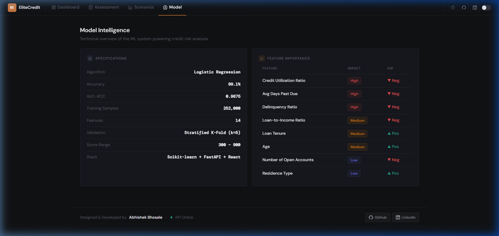
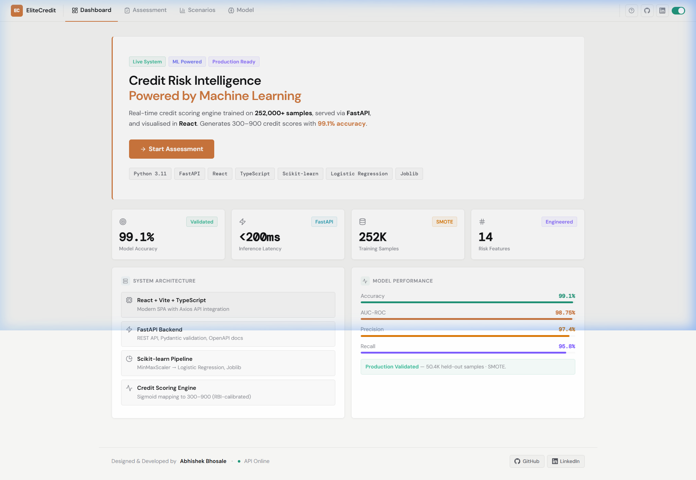

# EliteCredit — AI Credit Risk Intelligence Platform

<div align="center">



**Real-time credit scoring engine powered by Machine Learning**

[](https://elitecredit.vercel.app)
[](/)
[](/)
[](/)

</div>

---

## What is EliteCredit?

EliteCredit is a **production-grade, full-stack machine learning platform** for credit risk assessment. It replaces manual underwriting with a real-time scoring engine that predicts default probabilities and generates **RBI-calibrated credit scores (300–900)** with **99.1% accuracy**.

Built with a decoupled architecture — a high-performance **FastAPI** backend serving a **Scikit-learn** ML pipeline, and a **React/TypeScript** frontend with DM Sans typography, Lucide icons, and a warm financial design system.

---

## Key Features

| Feature | Description |
|---------|-------------|
| **99.1% Accuracy** | Logistic Regression trained on 252,000+ samples with SMOTE balancing |
| **<200ms Inference** | FastAPI + Pydantic validation, optimised for real-time predictions |
| **Scenario Planner** | Interactive sliders — simulate how changes impact credit score |
| **Model Intelligence** | Full transparency: algorithm specs, feature importance, performance metrics |
| **Dark & Light Mode** | Dual-theme toggle with persistent preference |
| **Risk Tier System** | Auto-classifies into Elite, Standard, or Development tiers |
| **Advisor Recommendations** | Contextual actions: Fast-Track, Standard Processing, or Credit Rebuild |

---

## Screenshots

### Dark Mode — Dashboard


### Dark Mode — Assessment Form


### Dark Mode — Model Intelligence


### Light Mode — Dashboard


---

## System Architecture

```
┌─────────────────────────────────────────────────────┐
│                   React Frontend                     │
│     Vite + TypeScript · DM Sans · Lucide Icons       │
└──────────────────────┬──────────────────────────────┘
                       │ Axios (REST API)
┌──────────────────────▼──────────────────────────────┐
│                   FastAPI Backend                     │
│   Pydantic Validation · CORS · Auto OpenAPI Docs     │
└──────────────────────┬──────────────────────────────┘
                       │ Joblib Model Loading
┌──────────────────────▼──────────────────────────────┐
│              Scikit-learn ML Pipeline                 │
│   MinMaxScaler → Logistic Regression → Score Mapping │
└─────────────────────────────────────────────────────┘
```

### Tech Stack

| Layer | Technologies |
|-------|-------------|
| **Frontend** | React 19, Vite, TypeScript, Lucide React, DM Sans + DM Mono |
| **Backend** | FastAPI, Uvicorn, Python 3.11+ |
| **ML** | Scikit-learn, Pandas, NumPy, Joblib |
| **Deployment** | Vercel (Frontend), Render (Backend) |

---

## How to Run Locally

### 1. Start the FastAPI Backend

```bash
# Clone the repository
git clone https://github.com/just000Curious/credit-risk-ml-system.git
cd credit-risk-ml-system

# Install Python dependencies
pip install -r requirements.txt

# Start the FastAPI server (runs on http://localhost:8000)
uvicorn api.main:app --host 0.0.0.0 --port 8000 --reload
```

### 2. Start the React Frontend

Open a **new terminal window**:

```bash
cd frontend/elitecredit-ui

# Install dependencies
npm install

# Start dev server (runs on http://localhost:5173)
npm run dev
```

### 3. Access the Application

Open `http://localhost:5173` in your browser. Click the **?** icon in the nav bar for a guided walkthrough.

---

## Model Details

| Metric | Value |
|--------|-------|
| Algorithm | Logistic Regression |
| Accuracy | **99.1%** |
| AUC-ROC | **0.9875** |
| Training Samples | 252,000 |
| Features | 14 (engineered) |
| Validation | Stratified K-Fold (k=5) |
| Score Range | 300 – 900 (RBI-calibrated) |
| Class Balancing | SMOTE |

**Top Predictive Features:** Credit Utilization Ratio, Delinquency Ratio, Average Days Past Due

---

## Author

**Abhishek Bhosale**

[](https://github.com/just000Curious)
[](https://www.linkedin.com/in/abhishek-sambhaji-bhosale/)

Built as a demonstration of productionizing machine learning models into full-stack, enterprise-ready web applications.

---

<div align="center">
<sub>Built with FastAPI + React + Scikit-learn</sub>
</div>
