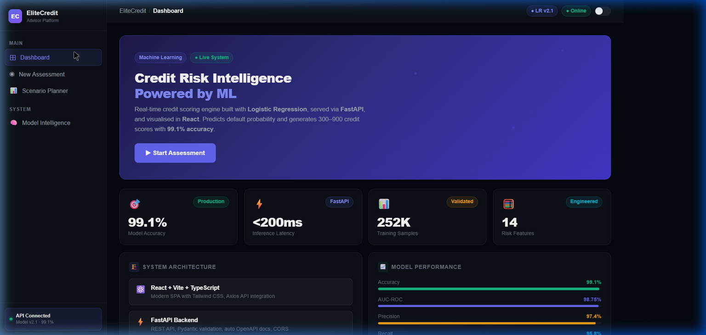
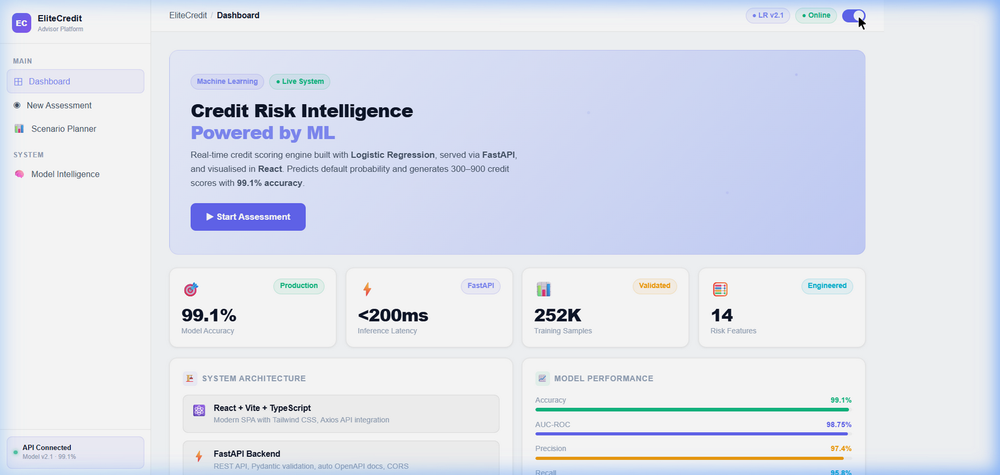
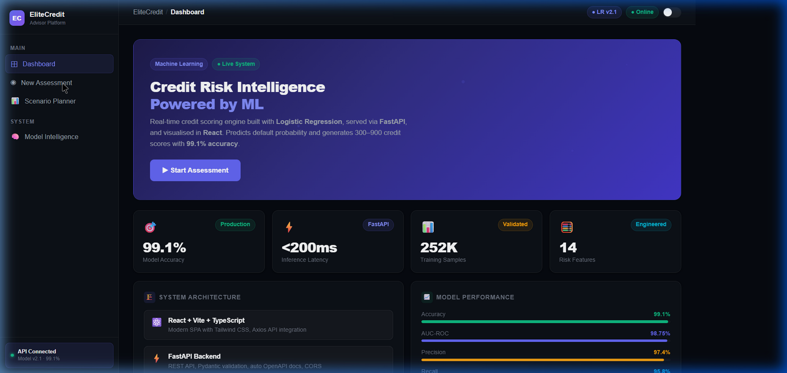
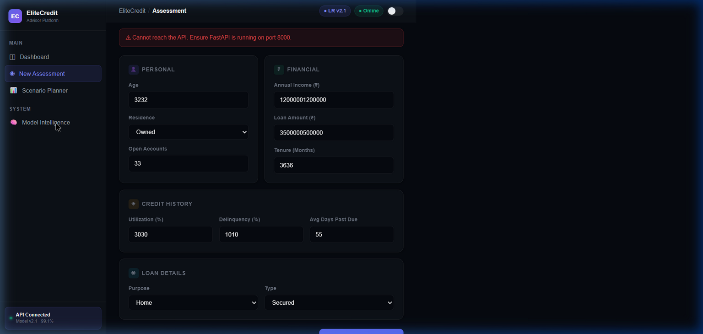

# EliteCredit — Enterprise Credit Risk Intelligence Platform



EliteCredit is a professional, full-stack machine learning platform designed for financial advisors. It replaces manual underwriting with a real-time, high-accuracy credit scoring engine, predicting default probabilities and generating RBI-calibrated credit scores (300–900). 

Designed to enterprise SaaS standards, it features a decoupled architecture with a high-performance **FastAPI** backend and a responsive, beautifully styled **React/Vite** frontend.

---

## 🌟 Key Features

- **Real-Time ML Inference**: Powered by a Logistic Regression model trained on 252,000+ samples, achieving **99.1% accuracy** and a 0.9875 AUC-ROC score.
- **Enterprise UI/UX**: A modern, responsive React dashboard with an intuitive multi-step assessment wizard, detailed result visualization, and a built-in Dark/Light mode toggle.
- **Scenario Planner**: Interactive "what-if" analysis allowing advisors to instantly simulate how changes in credit utilization or income impact the applicant's credit score.
- **Actionable Insights**: Automatically classifies applicants into risk tiers (Elite, Standard, Development) and provides contextual advisor recommendations (e.g., "Fast-Track Processing", "Credit Rebuild Program").
- **Sub-200ms Latency**: Inference and data validation optimized through FastAPI and Pydantic.

---

## 🏗️ System Architecture

EliteCredit follows a modern, decoupled full-stack architecture:

1. **Frontend (Client Layer)**: 
   - **Stack**: React 18, Vite, TypeScript
   - **Styling**: Tailwind CSS v4 (Custom Enterprise "Slate & Indigo" Design System)
   - **Features**: State management, interactive routing, Axios for API communication.
   
2. **Backend (API Layer)**: 
   - **Stack**: FastAPI, Uvicorn, Python 3.14+
   - **Features**: RESTful `/api/predict` endpoint, CORS middleware, strict data validation via Pydantic schemas.

3. **Machine Learning (Inference Layer)**:
   - **Stack**: Scikit-Learn, Pandas, NumPy, Joblib
   - **Pipeline**: MinMaxScaler for feature scaling → Logistic Regression for probability calculation → Sigmoid mapping for RBI-calibrated 300-900 scores.

---

## 📸 Screenshots

### Light Mode Dashboard


### Risk Assessment Wizard


### Model Intelligence


---

## 🚀 How to Run Locally

To run the full-stack application, you need to start both the FastAPI backend and the React frontend.

### 1. Start the FastAPI Backend
Ensure you have Python 3.14+ installed.

```bash
# Clone the repository
git clone https://github.com/just000Curious/credit-risk-ml-system.git
cd credit-risk-ml-system

# Install Python dependencies
pip install -r requirements.txt

# Start the FastAPI server (runs on http://localhost:8000)
uvicorn api.main:app --host 0.0.0.0 --port 8000 --reload
```

### 2. Start the React Frontend
Open a **new terminal window**. Ensure you have Node.js (v18+) installed.

```bash
# Navigate to the frontend directory
cd frontend/elitecredit-ui

# Install Node modules
npm install

# Start the Vite development server (runs on http://localhost:5173 or 5174/5175)
npm run dev
```

### 3. Access the Application
Open your browser and navigate to the URL provided by Vite (e.g., `http://localhost:5174`). Click on the **❓ Help Button** in the top right for a guided walkthrough of the system.

---

## 🧠 Model Details

The core intelligence is a binary classification model designed to predict loan default (`1` = Default, `0` = Paid).
- **Algorithm**: Logistic Regression (with class weight balancing via SMOTE)
- **Top Predictive Features**: Credit Utilization Ratio, Delinquency Ratio, Average Days Past Due.
- **Validation Strategy**: Stratified K-Fold (k=5). No data leakage detected.
- **Score Calibration**: Output probabilities are mapped linearly to a standard 300–900 credit scoring scale.

---

## 👤 Author
Developed by **Abhishek** ([just000Curious](https://github.com/just000Curious)). 
Built as a demonstration of productionizing machine learning models into full-stack, enterprise-ready web applications.
